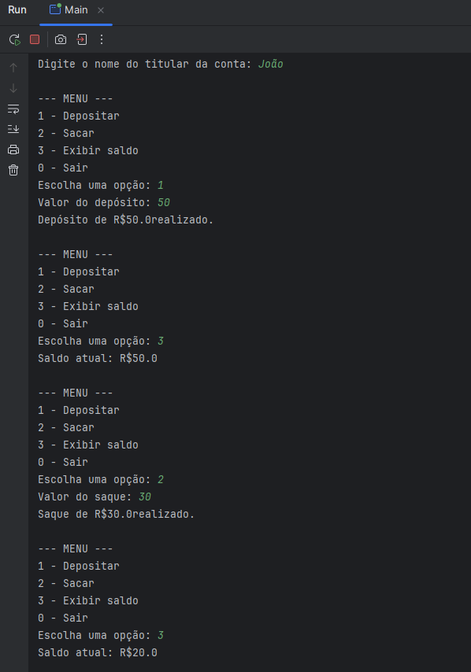

# 💰 Conta Bancária em Java

É um simulador simples de conta bancária em Java, feito para praticar conceitos de Programação Orientada a Objetos (POO).

## 🧠 Conceitos praticados

- Classes e objetos
- Encapsulamento
- Métodos
- Condicionais e loops
- Entrada de dados com Scanner

## 📦 Funcionalidades

- Criar uma conta bancária com nome do titular
- Depositar valor
- Sacar valor (com verificação de saldo)
- Exibir saldo atual

## ▶️ Como executar

1. Clone o repositório:

git clone https://github.com/seu-usuario/BancoSimples.git 

2. Abra o projeto no IntelliJ IDEA:
3. Execute a classe Main.java

## ▶️ Demonstração:

